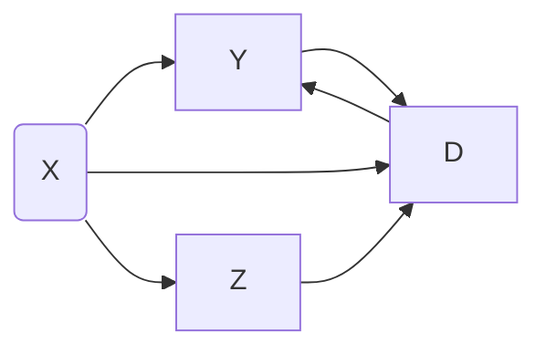

# DDML
distributed double machine learning


## Simulation 

### Simulation 1

partial linear regression model with known error density

parameter setting: 
- number of sites: $K = 5$
- sample size of each site: $n = 100$,
- dimensionality of covariates: $p_\beta$, 
- error density: normal distribution with variance $\psi_u$ and $\psi_v$, 

comments: 
- no machine learning model, no overfitting, no data splitting.


questions: 
- correlation between $U$ and $V$ in data generation?
  - no correlation between $U$ and $V$.

### Simulation 2: Partial linear regression model

Model description: 
$$
    Y^{(j)} = D^{(j)} \beta + \gamma_j(X^{(j)}) + U^{(j)}, \quad E[U^{(j)} | X^{(j)}, D^{(j)}], \\
    D^{(j)} = \mu_j(X^{(j)}) + V^{(j)}, \quad E[V^{(j)} | X^{(j)}]. \\
$$

Code: `sim2.py`
- based on the partialling-out method with reparameterization.
- issue: the scale of estimated $S$ is smaller that the oracle estimated $S$, with known nuisance parameter.
  - the oracle estimated $S$ leads to valid surragte orthogonal estimation.

Code: `sim2_S_ora.py`
- focus on the comparison of the estimation and oracle estimation of $S$.
- same issue as before.

Code: `sim2_rf_est.py`
- setting: the nuisance functionals are linear,
- compare random forest and linear regression estimation.

---

Code: `sim2_org.py`
- based on original parameterization.
- the initial value $\tilde\beta$ is token as the regression coefficient of $D$ on $Y$ based on $\mathcal{D}_2^{(j)}$.
- following iterations improve the estimation accuracy.

*Code*: `sim2_org_ini.py`
- to avoid the influence from initial value $\tilde\beta$, we consider more accurate one.
  - estimate $\mathbb{E}[Y|X]$ and $\mathbb{E}[D|X]$, 
  - calculate the regression coefficient of $D - \mathbb{E}[D|X]$ on $Y - \mathbb{E}[Y|X]$,
  - the coefficient is stable and is actually based on the partialling-out method.
- basic setting: 
  - $K = 5$, 
  - $n = 100$, 
  - $c_j = -0.25$, 
  - uncorrelated $X$,  
  - replication $100$, 
- results 
  - parameter setting: $n = 100, K = 5, c_j = 0.25$ with uncorrelated $X$ and $100$ times replications,
    ```
               Average          M1          M2
      mean    1.939852    2.044211    2.027772
      std     0.160080    0.151424    0.155032
      min     1.575580    1.657900    1.628714
      50%     1.917788    2.035588    2.008019
      max     2.275209    2.377777    2.376708
    ```
  - parameter setting: $n=500, K=5, c_j = 0.25$ with uncorrelated $X$ and $100$ times replications:
      ```
                  Average          M1          M2
        mean     1.966512    2.010897    2.007574
        std      0.066395    0.067333    0.067242
        min      1.793901    1.868114    1.860205
        50%      1.964771    2.010101    2.005116
        max      2.157543    2.169124    2.172327 
      ```
  - parameter setting: $n = 100, K = 5, c_j = -0.25$ with correlated $X$ and $100$ times replications,
    ```
    ```
    - remark: density ratio.
  - parameter setting: $n = 100, K = 5, c_j = 0.25$ with uncorrelated $X$ and $100$ times replications,
    ```
    ```

Code: `sim_org_ini_rds.py`
- randomly split the data set into two parts.
- setting: $n = 100, K = 5, c_j = 0.25$, uncorrelated $X$.

Code: `sim_org_ini_rds_f.py`
- `f` for file, saving output to specified file

Code: `sim_org_ini_rds_.py`
- for checking specific random seed


~~code: `sim2_org_ini_rdsu.py`~~
- updating random splitting of index in each iteration,
- Not reasonable!


### Simulation 3: Partial linear instrumental variable regression

Model description: 
$$
    Y^{(j)} - D^{(j)} \beta = \gamma_j(X^{(j)}) + U^{(j)}, \quad E[U^{(j)} | X^{(j)}, Z^{(j)}], \\
    Z^{(j)} = \mu_j(X^{(j)}) + V^{(j)}, \quad E[V^{(j)} | X^{(j)}]. \\
$$





- `sim3.py`: simulation 3
  - features: 
  - copied from `sim2_org_ini_rds.py`,
    - option to choose nonrandom data splitting (by default) or random data splitting,
  - data generation: $D \sim \text{Normal}(Z, \psi_d)$.

- `sim3_std.py`
  - `std` for the standard case with structural equations: 
    $$
      D^{(j)} = Z^{(j)} + \upsilon_j(X^{(j)}) + \epsilon_d^{(j)}, \\
    $$
    with 
    $$
      \upsilon_j(x_i^{(j)}) = \frac{\exp(x_{i, j+1}^{(j)})}{1 + \exp(x_{i, j+1}^{(j)})}.
    $$
- 


