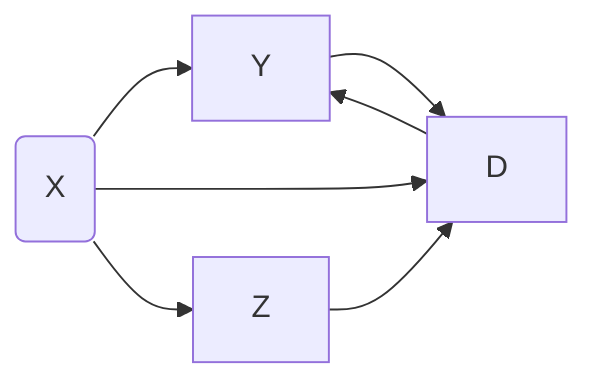
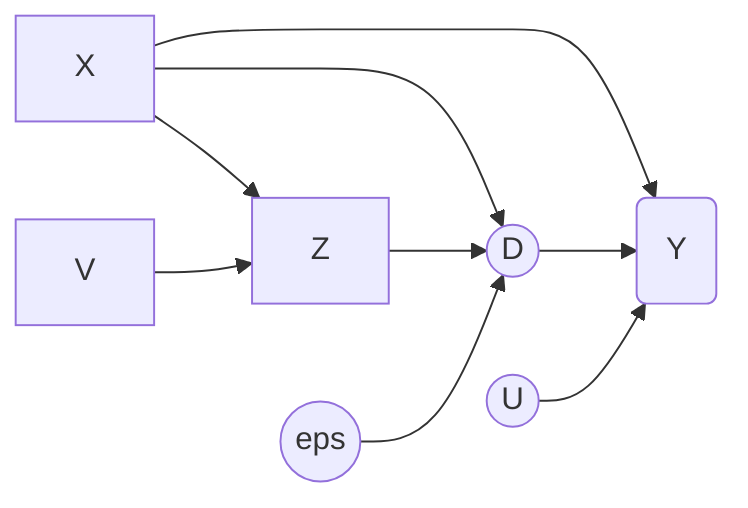

# DDML
distributed double machine learning


## Simulation 

### Simulation 1
---

partial linear regression model with known error density

parameter setting: 
- number of sites: $K = 5$
- sample size of each site: $n = 100$,
- dimensionality of covariates: $p_\beta$, 
- error density: normal distribution with variance $\psi_u$ and $\psi_v$, 

comments: 
- no machine learning model, no overfitting, no data splitting.

questions: 
- correlation between $U$ and $V$ in data generation?
  - no correlation between $U$ and $V$.

### Simulation 2: Partial linear regression model
---

Model description: 
$$
    Y^{(j)} = D^{(j)} \beta + \gamma_j(X^{(j)}) + U^{(j)}, \quad E[U^{(j)} | X^{(j)}, D^{(j)}], \\
    D^{(j)} = \mu_j(X^{(j)}) + V^{(j)}, \quad E[V^{(j)} | X^{(j)}]. \\
$$

Code: `sim2.py`
- based on the partialling-out method with reparameterization.
- issue: the scale of estimated $S$ is smaller that the oracle estimated $S$, with known nuisance parameter.
  - the oracle estimated $S$ leads to valid surragte orthogonal estimation.

Code: `sim2_S_ora.py`
- focus on the comparison of the estimation and oracle estimation of $S$.
- same issue as before.

Code: `sim2_rf_est.py`
- setting: the nuisance functionals are linear,
- compare random forest and linear regression estimation.

---

Code: `sim2_org.py`
- based on original parameterization.
- the initial value $\tilde\beta$ is token as the regression coefficient of $D$ on $Y$ based on $\mathcal{D}_2^{(j)}$.
- following iterations improve the estimation accuracy.

*Code*: `sim2_org_ini.py`
- to avoid the influence from initial value $\tilde\beta$, we consider more accurate one.
  - estimate $\mathbb{E}[Y|X]$ and $\mathbb{E}[D|X]$, 
  - calculate the regression coefficient of $D - \mathbb{E}[D|X]$ on $Y - \mathbb{E}[Y|X]$,
  - the coefficient is stable and is actually based on the partialling-out method.
- basic setting: 
  - $K = 5$, 
  - $n = 100$, 
  - $c_j = -0.25$, 
  - uncorrelated $X$,  
  - replication $100$, 
- results 
  - parameter setting: $n = 100, K = 5, c_j = 0.25$ with uncorrelated $X$ and $100$ times replications,
    - `out_sim2_org_ini_K5_n100_iter100.csv`,
      - `rnp` from `128-227`,
    - `out_sim2_org_ini_K5_n100_iter100_v2.csv`,
      - `rnp` from `2023-2122`.
  - parameter setting: $n=500, K=5, c_j = 0.25$ with uncorrelated $X$ and $100$ times replications:
  - parameter setting: $n = 100, K = 5, c_j = -0.25$ with correlated $X$ and $100$ times replications,
    ```
    ```
    - remark: density ratio.
  - parameter setting: $n = 100, K = 5, c_j = 0.25$ with uncorrelated $X$ and $100$ times replications,
    ```
    ```

Code: `sim2_org_ini_rds.py`
- randomly split the data set into two parts.
- setting: $n = 100, K = 5, c_j = 0.25$, uncorrelated $X$.

Code: `sim2_org_ini_rds_f.py`
- `f` for file, saving output to specified file

Code: `sim2_org_ini_rds_.py`
- for checking specific random seed

#### different density estimation methods

Code: `sim2_org_ini_rds_ad_args.py`
- `ad` for adjusted (double-equation) density estimation
  - default is single-equaiton density estimation

Code: `sim2_org_ini_rds_odd_args.py`
- `odd` for oracle double equation density estimation

#### K vars

Code: `sim2_org_ini_rds_Kvar_args.py`
- output: `out_sim2_org_ini_K{5,10,20,50}_n{200,1000}_p60_rnp100_rnd10_rft{200,500}.csv`, 
- 

Code: `sim2_org_ini_rds_Kvar_args_.py`
- check the prediction error of random forest (power of machine learning method).

Code: `sim2_org_ini_rds_Kvar_denest_args.py`
- option for selecting the density estimation method,
  - single-equation (`single`) or oracle double-equation estimation (`ora_dou`),
- 


#### abandoned

~~code: `sim2_org_ini_rdsu.py`~~
- updating random splitting of index in each iteration,
- Not reasonable!


#### new curve setting

Code: `sim2s_args.py`
- from `sim2_org_ini_rds_Kvar_denest_args.py`,
- $\beta^* = 0.5$, $\text{var}(U) = \text{var}(V) = 1$,
- default value: 
  - correlated covariates $X$: $\rho = 0.7$, 
  - 

Code: `sim2s_args_.py`
- check the prediction error of ML method
- 

Code: `sim2s_args_x.py`
- acceleration with gpu,
- switching - data splitting

Code: `sim2s_args_xx.py`
- acceleration with gpu,
- data splitting

#### covariate shift

Code: `sim2cs_args_x.py`
- uncorrelated covariates
- covarites shifts: for $k$-th group, $X_k \sim \mathcal{N}(0, 1) \rightarrow X_k \sim \mathcal{N}(1, 4)$ 

Code: `sim2cs_ora_args_x.py`
- oracle estimation for covariates density ratio
  $$
    -2\log w^{(j)}(x) = [\frac{3}{4} (x_1 + x_j) + \frac{1}{2}] \cdot (x_1 - x_j),
  $$
- output: `out/sim2cs_ora_x_K5_n1000_p20.csv`.

Code: `sim2cs_expt_args_x.py`
- correlated covariates
- `expt` for exponential tilting

Code: `sim2cs_expt_ora_args_x.py`
- correlated covariates
- `expt` for exponential tilting

Code: `sim2cs_expt2_args_x.py`
- exponential tilting with 2 covarites


#### unbalance sample sizes

Code: `sim2s_ub1_args_x.py`
- unbalanced sample size: $n \times [0.5, 0.75, 1.0, 1.25, 1.5]$, 


Code: `sim2s_ub2_args_x.py`
- unbalanced sample size: $n \times [1.0, 1.0, 1.0, 1.0, 0.2]$, 


### Simulation 2 new

- code: `sim2n_ora.py` - `sim2n_rf_test.py` - `sim2n_rareCov_test.py`
  ```sh
  [1]   Done                    python code/simulation/sim2n.py --n_rnp=1000 --n_rds=1 --n=500 --n_rft=100 --p=10 --den_est="ora_dou" --path_out="output/out_sim2n_ora_rnp1k_n5h_rft1h_p10_oraDuo.csv"
  [2]-  Done                    python code/simulation/sim2n.py --n_rnp=1000 --n_rds=1 --n=100 --n_rft=100 --p=10 --den_est="ora_dou" --path_out="output/out_sim2n_ora_rnp1k_n1h_rft1h_p10_oraDuo.csv"
  [3]+  Done                    python code/simulation/sim2n.py --n_rnp=1000 --n_rds=1 --n=500 --n_rft=100 --p=10 --path_out="output/out_sim2n_ora_rnp1k_n5h_rft1h_p10_sinDen.csv"
  ```

- adjustment: `psi_v = 0.1`
  ```sh
    python code/simulation/sim2n_rf_test.py --n_rnp=1000 --n_rds=1 --n=500 --n_rft=100 --p=10 --den_est="ora_dou" --path_out="output_sim2n_ora_rnp1k_n5h_p10_psiV01_oraDuo.csv"
    python code/simulation/sim2n_rf_test.py --n_rnp=1000 --n_rds=1 --n=500 --n_rft=100 --p=10 --den_est="single" --path_out="output/output_sim2n_ora_rnp1k_n5h_p10_psiV01_single.csv"
  ```

- adjustment: 
  1. `psi_v = 10`
  2. setting 3: `out = 2.0 * fun_sigm(20 * (x[j] - 2.0)) + 0.25 * x[jp]` 
  ```sh
    python code/simulation/sim2n_rf_test.py --n_rnp=1000 --n_rds=1 --n=500 --n_rft=100 --p=10 --den_est="single" --path_out="output/out_sim2n_ora_rnp1k_n5h_p10_psiV10_single.csv" &
    mv output/out_sim2n_ora_rnp1k_n5h_p10_psiV10_single.csv output/out_sim2n_ora_rnp1k_n5h_p10_psiV10_set3_single.csv
  ```

- adjustment: rare treatment
  1. back to `psi_v = 1`, 
  2. setting 4: `out = 20 * fun_sigm(20 * (x[j] - 2.0)) + 0.25 * x[jp]` 
  ```sh
    python code/simulation/sim2n_rf_test.py --n_rnp=1000 --n_rds=1 --n=500 --n_rft=100 --p=10 --den_est="single" --path_out="output/out_sim2n_ora_set4.csv" &
  ```

- adjustment: (binary) rare treatment 
  1. back to `psi_v = 1` and `psi_u = 1`
  2. rareCov setting 1: `out = 20 * fun_sigm(20 * (X[j] - 2.0)) + .25 * X[jp] ## rareCov - setting 1`
  3. binary treatment: `mat_D[:, j] = 20 * (mat_D[:, j] > 3.0).astype(float)`
  ```sh
    python code/simulation/sim2n_rareCov_test.py --n_rnp=1000 --n_rds=1 --n=500 --n_rft=100 --p=10 --den_est="single" --K=5 --path_out="output/out_sim2n_ora_rareCovSet1_biT.csv" &
    python code/simulation/sim2n_rareCov_test.py --n_rnp=1000 --n_rds=10 --n=500 --n_rft=100 --p=10 --den_est="single" --K=5 --path_out="output/out_sim2n_ora_rareCovSet1_biT_rds10.csv" &
    python code/simulation/sim2n_rareCov_test.py --n_rnp=1000 --n_rds=1 --n=300 --n_rft=100 --p=10 --den_est="single" --K=5 --path_out="output/out_sim2n_ora_rareCovSet1_biT_n3h.csv" &
  ```
  remark: 
  - sample `n=300` works worse than `n=500`,
  - try `n_rds=10` to prevent outliers.

- adjustment: (mixture) rare treatment
  1. `psi_v = 0.1`
  2. rareCov setting 2: `out = 10 * fun_sigm(50 * (X[j] + .25 * X[jp] - 1.8))   ## rareCov - setting 2`
  3. `beta = 0.2`
  ```sh
    python code/simulation/sim2n_rareCov_test.py --n_rnp=1000 --n_rds=10 --n=500 --n_rft=100 --p=10 --den_est="single" --K=5 --path_out="output/out_sim2n_ora_rareCovSet2_mixT_beta02_psiv01.csv" &
    python code/simulation/sim2n_rareCov_test.py --n_rnp=1000 --n_rds=10 --n=500 --n_rft=100 --p=10 --den_est="single" --K=5 --path_out="output/out_sim2n_ora_rareCovSet1s_mixT.csv" &
  ```

- adjustment: double error term
  1. `out = 20 * fun_sigm(20 * (X[j] - d)) + .25 * X[jp]   ## rareCov - setting 1 (- d2.0)`, `d = 2.0, 1.5, 1.0`,
  2. with inflection point $3.0$ and $10.0$
  ```sh
    python code/simulation/sim2n_rareCov_test.py --n_rnp=1000 --n_rds=10 --n=500 --n_rft=100 --p=10 --den_est="single" --K=5 --path_out="output/out_sim2n_ora_rareCovSet1d20_mixT.csv" &
    python code/simulation/sim2n_rareCov_test.py --n_rnp=1000 --n_rds=10 --n=500 --n_rft=100 --p=10 --den_est="single" --K=5 --path_out="output/out_sim2n_ora_rareCovSet1d15_mixT.csv" &
    python code/simulation/sim2n_rareCov_test.py --n_rnp=1000 --n_rds=10 --n=500 --n_rft=100 --p=10 --den_est="single" --K=5 --path_out="output/out_sim2n_ora_rareCovSet1d10_mixT.csv" &
  ```

- adjustment: rare covariate single error term
  1. `mu = 0.25 * x[j] + 10 * sigm( x[j] ) + 0.25 * x[j + p]`
  ```sh
    python code/simulation/sim2n_rareCov_test1.py --n_rnp=500 --n_rds=5 --n=500 --n_rft=100 --p=10 --den_est="single" --K=5 --mu_ip=2.0 --path_out="output/out_sim2n_rareCovSet1t1_ip20_mixT.csv" &
    python code/simulation/sim2n_rareCov_test1.py --n_rnp=500 --n_rds=5 --n=500 --n_rft=100 --p=10 --den_est="single" --K=5 --mu_ip=1.5 --path_out="output/out_sim2n_rareCovSet1t1_ip15_mixT.csv" &
    python code/simulation/sim2n_rareCov_test1.py --n_rnp=500 --n_rds=5 --n=500 --n_rft=100 --p=10 --den_est="single" --K=5 --mu_ip=1.0 --path_out="output/out_sim2n_rareCovSet1t1_ip10_mixT.csv" &
  ```

- adjustment: rare covariate single error term
  1. `mu = 20 * sigm( x[j] ) + 0.25 * x[j + p]`
  ```sh
    python code/simulation/sim2n_rareCov_test2.py --n_rnp=500 --n_rds=5 --n=500 --n_rft=100 --p=10 --den_est="single" --K=5 --mu_ip=2.0 --path_out="output/out_sim2n_rareCovSet1t2_ip20_mixT.csv" &
    python code/simulation/sim2n_rareCov_test2.py --n_rnp=500 --n_rds=5 --n=500 --n_rft=100 --p=10 --den_est="single" --K=5 --mu_ip=1.5 --path_out="output/out_sim2n_rareCovSet1t2_ip15_mixT.csv" &
    python code/simulation/sim2n_rareCov_test2.py --n_rnp=500 --n_rds=5 --n=500 --n_rft=100 --p=10 --den_est="single" --K=5 --mu_ip=1.0 --path_out="output/out_sim2n_rareCovSet1t2_ip10_mixT.csv" &
  ```
  2. follow up with larger psi_v = 4
  ```sh
    python code/simulation/sim2n_rareCov_test2.py --n_rnp=500 --n_rds=5 --n=500 --n_rft=100 --p=10 --den_est="single" --K=5 --mu_ip=2.0 --path_out="output/out_sim2n_rareCovSet1t2_ip20_mixT_psiv4.csv" &
    python code/simulation/sim2n_rareCov_test2.py --n_rnp=500 --n_rds=5 --n=500 --n_rft=100 --p=10 --den_est="single" --K=5 --mu_ip=1.5 --path_out="output/out_sim2n_rareCovSet1t2_ip15_mixT_psiv4.csv" &
    python code/simulation/sim2n_rareCov_test2.py --n_rnp=500 --n_rds=5 --n=500 --n_rft=100 --p=10 --den_est="single" --K=5 --mu_ip=1.0 --path_out="output/out_sim2n_rareCovSet1t2_ip10_mixT_psiv4.csv" &
  ```
  3. follow up with larger psi_v = .1
  ```sh
    python code/simulation/sim2n_rareCov_test2.py --n_rnp=500 --n_rds=5 --n=500 --n_rft=100 --p=10 --den_est="single" --K=5 --mu_ip=2.0 --path_out="output/out_sim2n_rareCovSet1t2_ip20_mixT_psiv4.csv" &
    python code/simulation/sim2n_rareCov_test2.py --n_rnp=500 --n_rds=5 --n=500 --n_rft=100 --p=10 --den_est="single" --K=5 --mu_ip=1.5 --path_out="output/out_sim2n_rareCovSet1t2_ip15_mixT_psiv4.csv" &
    python code/simulation/sim2n_rareCov_test2.py --n_rnp=500 --n_rds=5 --n=500 --n_rft=100 --p=10 --den_est="single" --K=5 --mu_ip=1.0 --path_out="output/out_sim2n_rareCovSet1t2_ip10_mixT_psiv4.csv" &
  ```

> sim2m_rareCov_test7_vgam.py

main file to conduct simualtion with PLR

> sim2mc_test7_vgam.py

PLR with continuous function

> sim3mr_vgam.py, sim3mc_vgam.py

PLIVR with rare-binary or continuous treatment/IV

rare treatment assignment: 
$$
  [D | Z=1]   
$$

> sim2mr_cs_vgam.py

from `sim2m_rareCov_test7_vgam.py`, consider covariate shift


### Simulation 3: Partial linear instrumental variable regression
---


Model description: 
$$
    Y^{(j)} - D^{(j)} \beta = \gamma_j(X^{(j)}) + U^{(j)}, \quad E[U^{(j)} | X^{(j)}, Z^{(j)}] = 0, \\
    Z^{(j)} = \mu_j(X^{(j)}) + V^{(j)}, \quad E[V^{(j)} | X^{(j)}] = 0. \\
$$




#### Setting 1: 
- `sim3.py`: simulation 3
  - copied from `sim2_org_ini_rds.py`,
    - option to choose nonrandom data splitting (by default) or random data splitting,
  - data generation: $D \sim \text{Normal}(Z, \psi_d)$.
  - outputs: 
    - `out_sim3_K5_n100_iter100_psid01.csv`
    - `out_sim3_K5_n100_iter100_psid9.csv`
    - `out_sim3_K5_n100_iter100_psid36.csv`

- `sim3_args.py`: simulation 3 with args, 
  - `sim3_args_.py` for single input error case test.

#### Setting 2:
- `sim3_std.py`
  - `std` for the standard case with structural equations: 
    $$
      D^{(j)} = Z^{(j)} + \upsilon_j(X^{(j)}) + \epsilon_d^{(j)}, \quad
      \upsilon_j(x_i^{(j)}) = \frac{\exp(x_{i, j+1}^{(j)})}{1 + \exp(x_{i, j+1}^{(j)})}.
    $$
  - `sim3_std_args.py` with args input from command line, 
  - `sim3_std_args_.py` for single input, error case test.


Alternative density estimation: 
- `sim3_std_dd_args.py`
  - `dd` for double equation density estimation
- `sim3_std_otd_args.py`
  - `otd` for oracle trible equation density estimation


#### Setting 3: endogenous
- `sim3_edg_args.py`,
- $D$ is correlated to $U$.
- data generation: 
  - generate correlated $U$ and $\epsilon_d$ with correlation $\rho=0.75$.



- `sim3_edg_jd_args.py`
  - `jd` for joint density estimation


- `sim3_edg_psid_jd_args.py`
  - `psi_d` is site-specific parameter.

#### new curve setting

Curve: 
$$
  \begin{cases}
    \gamma_j^*(x_i^{(j)}) = x_{i, j}^{(j)} + 0.25 \times \text{sigm}(x_{i, j+2}^{(j)}), \\
    \mu_j^*(x_i^{(j)}) = \text{sigm}(x_{i, j}^{(j)}) + 0.25 \times x_{i, j+2}^{(j)}, 
  \end{cases}
$$

- `sim3s_edg_args.py`
  - from `sim3_edg_jd_args.py`

- `sim3s_edg_args_.py`
  - from `sim3_edg_args.py`

- `sim3s_edg_args__.py`
  - from `sim3_edg_args.py`
  - check the outlier with (K, rnd_np, rnd_ds) = $(5, 211, 137)$

- `sim3s_edg_args_rf.py`
  - from `sim3_edg_jd_args.py`
  - minimal example to test the parameter of random forest
  - `output/out_sim3s_edg_rfs${rf_set}_test.csv`

- `sim3s_edg_args_rf_.py`
  - grid search for the best parameter for random forest


#### ~~adjusted curve setting~~

Curve: 
$$
    \gamma_j^*(x_i^{(j)}) = x_{i, j}^{(j)} + 0.25 \times \text{sigm}(x_{i, j+2}^{(j)}), \\
    \mu_j^*(x_i^{(j)}) = \text{sigm}(x_{i, j}^{(j)}) + 0.25 \times x_{i, j+2}^{(j)}, 
$$


### Simulation 4

model description: 
$$
  Y_i^{(j)} = \gamma^*(D_i^{(j)}, X_i^{(j)}) + U_i^{(j)}, \quad \mathbb{E}[U_i^{(j)} | X_i^{(j)}, D_i^{(j)}] = 0, \\
  D_i^{(j)} = \mu^*(X_i^{(j)}) + V_i^{(j)}, \quad \mathbb{E}[V_i^{(j)} | X_i^{(j)}] = 0,
$$
where $D$ is binary treatment variable, true value of functions $\gamma^*(D, X) = \mathbb{E}[Y | D, X]$, $\mu^*(X) = \text{Pr}(D = 1 | X)$.


- `sim4_args.py`
  - simulation 4
  - $S_j$ with the average of local nuisance par estiamtion $\bar\eta = 1/K \sum_{k} \eta_k$, 
  - improvement results from better estimation of nuisance par.
- `sim4_args__.py`
  - $S_j$ with local estimation $\eta_j$, 
  - M1 == local average estimation for $\beta$.


### Simulation 5

model description: 

- `sim5.py`
  - soft classifier for `nu` and `gamma`
- `sim5_rf.py`
  - random forest
- `sim5_hard.py`
  - hard classifier for `nu`
  - improvement is not significant
- `sim5_split.py`
  - estimate `nu(0, -)` / `nu(1, -)` and `mu(0, -)` / `mu(1, -)` seperately, 
- `sim5_split_gpu.py`
  - error
  ```
  RuntimeError: No device of requested type available. Please check https://software.intel.com/content/www/us/en/develop/articles/intel-oneapi-dpcpp-system-requirements.html -1 (PI_ERROR_DEVICE_NOT_FOUND)
  ```
- `sim5s_split.py`
  - new setting
- 
- 


## Summary

- mean or median?
  - equivalent when sample size is large


## Real Data Analysis

This part is completed by @Xinjie Qian.

Data: 
- `1.csv` data from ADNI 1, 
- `2.csv` data from ADNI 2, 
- `go.csv` data from ADNI GO.

Data Info: 
- `MMSE`: response, 
- `log`: treatment, log-transformed hippocampal volume, 
- `AGE`-`APOE4`: covariates.


